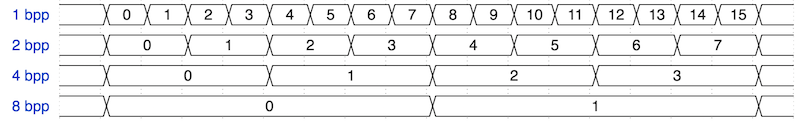
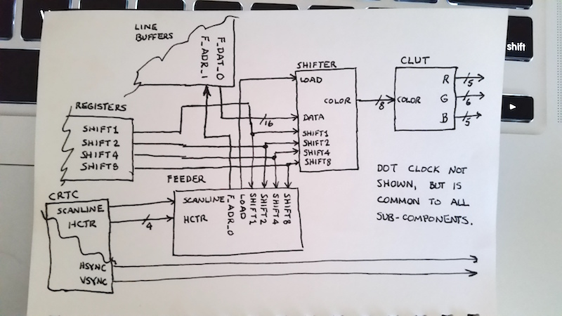

The Kestrel-3 requires a bitmapped video display of some kind.
Without a video display, it would be extremely difficult to use the Kestrel-3 as a home computer as the term is commonly understood.
The Configurable Graphics Interface Adapter (CGIA) is responsible for rendering the contents of a bitmapped buffer to a VGA monitor.
The CGIA is a fully open source, easily understood video display interface.

In this article,
I attempt to explain the current CGIA display architecture.
Note that the CGIA is optimized for productivity,
so features like sprites don't (yet) exist in this design.
Where possible, I'll discuss opportunities for inclusion of such features going forward.

## CGIA Components

The CGIA consists of a few components that all work together to form a cohesive whole.  Before explaining how all the pieces fit together, I need to explain what their respective roles are first.

### Cathode Ray Tube Controller (CRTC)
The name of this component is a bit of an anacronism;
not many display devices today use cathode ray tubes (CRTs) anymore.
However, as it turns out, LCDs, plasma displays, OLED matrices, and more
are all driven with a similar interface.

The CRTC's primary job is to synchronize the video display enough to display a stable image.
For this to happen, the CRTC must tell the display device when a new raster line of video is coming (Horizontal Sync, or HSYNC)
and when a new frame is to be displayed (Vertical Sync, or VSYNC).
For this reason, the CRTC is responsible for generating the HSYNC and VSYNC signals.

Since the CRTC knows about the physical nature of the display,
it necessarily also knows about the logical structure as well.
For example, you might think a 640 pixel display occupies the full screen width,
but it really floats in an 800 pixel raster line.
Depending on where you place the 640 pixel logical line,
you can make the screen move left or right relative to the monitor's edges.
Thus, the CRTC is *also* responsible for telling the *rest* of the CGIA
when to draw graphics and when not to.

### Fetcher

Each visible line of graphics is a representation of some state in memory.
The *fetcher* is responsible for reading enough data into the CGIA's line buffers
for it to render the next line.

To accomplish this, it must steal the bus from the CPU (assuming the CPU already has it) for some amount of time.
For example,
a monochrome, 640-pixel wide display consists of 640 / 16 = 40 halfwords.
So, by configuring the fetcher to read 40 halfwords at a time,
it will read just enough video data into the line buffers for the other parts of the CGIA to render the scanline.

### Line Buffers

The *line buffers* comprise a temporary storage memory inside the CGIA.
It's used to decouple the relatively loose timing constraints of the memory bus
from the rather strict timing constraints of the VGA monitor.
This lets the CGIA fetch a whole line's worth of video data
while it's still busy displaying another.

### Feeder

The *Feeder* accepts video data from the line buffers, and
coordinates data flow into the shifter module.
In a certain sense, this is a lot like your heart:
while your heart is not responsible for conveying oxygen to your cells,
it *is* responsible for ensuring proper blood flow throughout your body.
It does this with, among other things, a regular heartbeat.
So it is with the feeder:
it is responsible for addressing the *correct* halfword from the line-buffers,
and telling the shifter *when* to reload from the addressed data
(just like a regular heartbeat).

### Shifter

The *Shifter* is responsible for actually interpreting the raw halfwords fetched by the Fetcher.
The following table illustrates how pixels are packed:

|Bits Per Pixel|Total Colors On Screen|
|:------------:|:--------------------:|
|1|2|
|2|4|
|4|16|
|8|256|

They are packed as follows:

Each color is pushed out of a *color index bus*,
sometimes more simply referred to as just the *color bus*.
Up to 256 colors are supported.

### Color Look-Up Table (CLUT)

The *Color Look-Up Table* is responsible for translating
the color indices found on the color index bus
into the red, green, and blue triples used by the VGA monitor.

### Register Set

The *register set* is a block of program-accessible
configuration settings which allows software to control the operation of the
various CGIA components.
For example, one "palette register" exists for each of the 256 supported colors.
Other registers exist allowing the programmer to select different horizontal resolutions, color depths, etc.

## Theory of Operation

Refer to this (poorly drawn) diagram:

If we work our way backwards through the CGIA, we first encounter the CLUT.
This is a fairly simple device; the `color` bus selects one of 256 color registers,
the results of which will appear on the `R`, `G`, and `B` component buses.
Externally to the CGIA, a R/2R DAC is used to create analog voltages,
and this is what drives the video signals on the monitor.

The CRTC is responsible for generating the HSYNC and VSYNC signals;
these are pretty simple, so I won't take more time describing them.

Notice that the *feeder* controls the *shifter*'s `load` input.
When asserted, this tells the *shifter* to read the data from the line buffers.
This signal must be asserted exactly one dot ahead of the intended left-edge
of the next batch of pixels.
So, for a monochrome display, it must be asserted on the 15th pixel shown.
For a 16-color display, it must be asserted on the 3rd, 7th, and 11th pixels as well.

Asserting the `load` signal also causes the *feeder* to increment
the line buffer fetch address.
This circuit depends on the *CRTC* negating the `scanline enable` signal
after the scanline is finished drawing.
Otherwise, this circuit would continue to fetch data from the line buffers,
even wrapping around to the beginning after done.
You would be able to test this by, for instance,
configurating the CGIA for a 640 pixel display,
but configuring the *fetcher* to read only 20 words.

The programmer-configured `shift1`, `shift2`, `shift4`, `shift8` signals
are used to tell the *shifter* how much to shift its register by.
This, in turn, also determines how many significant color bits exist on the color bus.
It also affects how frequently `load` is asserted (for reasons explained above),
which is why both the *feeder* and the *shifter* require knowledge of which is set.
The *feeder* always knows which pixel is being displayed because
it receives the four least significant horizontal pixel counter bits on the `hctr` input.

It is also required to fetch video data from the line buffers at the beginning of a scanline too.
This is why the *feeder* takes a `scanline enable` input from the *CRTC*.

**NOTE:** I might decide to move the `hctr` counter into the *feeder* itself at some point, as I think this will be necessary to support fine-grained horizontal alignment of the display.  It would be reset to zero when the `scanline` input negates, and would increment monotonically otherwise.

Not shown on this diagram (mainly because I ran out of room)
lies the *fetcher*, which couples to the video memory.
When the *CRTC* asserts the `scanline enable` input to the *feeder*,
it also commences another memory read from video memory via the *fetcher*.
This will deposit data into the line buffer *not used* by the *feeder*.
The *CTRC*, as you might imagine, would also be responsible for telling which line buffer the *feeder* should read from, and which the *fetcher* would write to.

## Status

As I write this, the following components *appear* to be completed:

* Line buffers
* Feeder
* Fetcher
* Shifter

The register set will be the *last* thing to be implemented,
since its interface naturally depends on the final configuration of the CGIA's parts.
The CRTC and CLUT components do not hold much risk, and so should be fairly easy to implement.
I'm hoping to have these components wrapped by this-coming Monday.

## Opportunities for Expansion

The *fetcher* is just a normal Wishbone bus master,
so detecting when it releases the bus is a trivial matter.
When this happens, it's entirely possible for additional modules to assume control of the bus.
These modules can support things like sprites, texture engines, blitters, etc.

Considering sprites in particular,
as I think I'll add a number of sprite engines in the future,
implementing sprite fetchers is a trivial task.
(It's the same code as the normal CGIA fetcher, but it addresses a different set of buffers.)
Serializing sprite information will be a tad more tricky,
as its timing parameters differ from the background playfield.
However, in principle, each sprite works exactly the same way as the normal playfield.
it requires a separate, parallel set of components.
Each sprite will need its own feeder, line buffer, and shifter components.
If they all derive their basic timing from the *CRTC*, then synchronization issues should not be a problem.

Finally, a simple multiplexer can switch between playfield and sprite data on a pixel-by-pixel basis.  It would sit directly in front of the CLUT (or, it could be an integral part of the CLUT module).

## Risks

While individual components may not pose any significant risks,
their integration poses *significant* risk.  By which, I mean, nothing is likely to work right out of the gate.

I've tried my hardest to make things as testable as I can,
in the hopes that the finished product not only is synthesizable,
but has a high probability of "just working".
I know this will never happen in real life;
but, until I have a real FPGA board to work with,
I have no idea if this circuit will actually work.

Another big risk with the CGIA design is how many FPGA resources it'll consume.  I'm hoping I can fit a minimal CGIA sans sprites into an iCE40HX4K package, preferably along with keyboard, mouse, and SD-card I/O as well.

## Conclusion

The CGIA represents a quantum leap from the MGIA.
It offers a greater array of video modes,
and for the first time, supports color.
It is also expandable, so it is relatively easy to add support for things like sprites.
