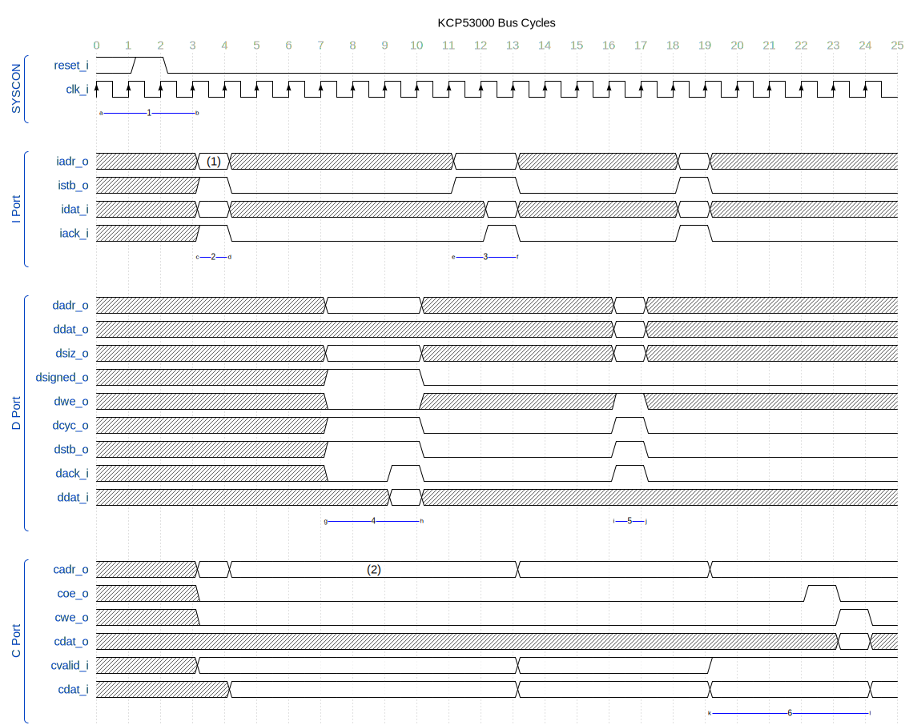

# Signal Descriptions

The diagram above illustrates
the signals exposed
by the processor for use in external circuitry.
As you can see, they are divided into four broad classes of signals.

All signals have a suffix attached to them,
indicating if they are inputs (`_i`) or outputs (`_o`), respectively.
Where reference can be made to either input or output signal,
we'll use a fictitious `_io` suffix.

## I Port

The processor uses the **I Port** to fetch new instructions to execute.

|Signal|Description|
|:----:|:----------|
|iack_i|Instruction data acknowledge.  When high, the data provided on `idat_i` will contain the next instruction for the processor to execute.  When low, wait states are inserted, allowing an external memory system time to handle the CPU's instruction fetch request.|
|iadr_o[63:0]|Instruction address bus.  This bus points to the next instruction to fetch.  This signal is valid only when `istb_o` is asserted.|
|idat_i[31:0]|Instruction data bus.  This bus will contain the 32-bit instruction fetched from the address provided on `iadr_o[63:0]`.|
|istb_o|Instruction bus strobe.  **This signal implies `icyc_o` as well**, which is why `icyc_o` is not explicitly provided on the interface.  While high, this signal indicates a valid instruction fetch is in progress.  The processor will wait for a corresponding assertion of `iack_i` before proceeding.|

Observe that the I Port signals properly subset those of the D Port.
In particular:

* No facility to support memory writes exists.
* No duplicate `icyc_o` signal; it's implied by the `istb_o` signal.
* No `isiz_o` signals exist, as all instructions are 32-bits.
* The data bus input port contains only 32 bits, enough to support the 32-bit wide RISC-V instruction set.

In all other respects, the I Port behaves analogously to the D Port.

## D Port

The processor uses the **D Port** to fetch or store data to memory.
Note that the memory space accessed on this port need not be the same
as that of the I port.

|Signal|Description|
|:----:|:----------|
|dack_i|Data acknowledge.  When high, the data transfer on the `ddat_i` signal (for reads) or `ddat_o` signal (for writes) has completed.  When low, wait states are inserted, allowing an external memory system time to handle the CPU's data fetch or store request.|
|dadr_o[63:0]|Data address.  This number points to the memory cell(s) which either hold or will hold the data of interest.|
|dcyc_o|Data bus cycle.  When high, a valid bus cycle is in progress.  Internally tied to `dstb_o`.|
|ddat_i[63:0]|Data bus, input.  During a read transaction, the data found at the address presented on `dadr_o` is to be presented on this signal.|
|ddat_o[63:0]|Data bus, output.  During a write transaction, the data to be stored appears on this signal.|
|dsigned_o|Data signed.  During a read transaction, this pin can be used to indicate if zero- or sign-extension is required.  See below for details.|
|dsiz_o[1:0]|Data transaction size.  Specifies byte (00), half-word (01), word (10), or double-word (11) size.|
|dstb_o|Data bus strobe.  When high, this signal indicates a valid data transaction (read or write) is in progress.  The processor will wait for a corresponding assertion of `dack_i` before proceeding.|
|dwe_o|Data write enable.  When high, this signal indicates a write, or store, transaction.  Data will flow *from* the CPU *to* memory, and will appear on `ddat_o`.  When low, this signal indicates a read, or fetch, transaction.  Data will flow *from* memory *to* the CPU over the `ddat_i` signal.|

Looking at the timing diagram for data transfers
(see Bus Timing section, below)
illustrates how closely this bus resembles the Wishbone bus specification.
However,
there are several important differences from Wishbone you need to be aware of.

### Transfer Sizes versus `sel_o` Byte Enables

With a Wishbone bus,
you rely on a truncated address bus (e.g., `adr_o[63:3]`; note that bits 2..0 are withheld)
to select a full-sized word in your target memory subsystem,
and then use `sel_o` signals (e.g., `sel_o[7:0]`) to select one or more
bytes from that full-sized word to interact with.
This approach is very efficient and convenient, particularly for peripheral vendors.

However, history shows this approach is as inconvenient as it is convenient.
The EISA and PCI interconnects, for example,
must spend gates on reconstructing `adr_o[2:0]`
in order to provide proper backward compatibility with legacy hardware.
It further must invest in external byte-steering logic
so that 8- or 16-bit peripherals can be used with a 32- or 64-bit data bus.
This logic must exist outside of the CPU, of course.

For a microprocessor vendor, however,
putting this logic in the critical path
both slows down the processor logic and
limits its flexibility.
For example, the 68000 and 68010 expose a byte-lane-based bus,
and throws exceptions when software attempts an unaligned memory reference
(e.g., attempting to write a 16-bit word on an odd address).
This severely impacts performance on several levels:

1.  The user-mode code is broken by lack of compatibility (if emulation is not supported),
2.  The user-mode code is slowed substantially by software emulation if it is supported,
3.  Because the exception handler runs in supervisor mode, the same mode as the host operating system, upgrading to a more feature-complete CPU microarchitecture implies replacing the portion of the operating system responsible for handling these exceptions, thus tieing the OS to a particular family of CPU microarchitectures.

All three of these approaches are clearly undesirable.

To reduce the latency of the processor design,
the KCP53000 exposes its internal data bus *as-is*,
without any byte-steering logic at all.
Thus, `ddat_i[7:0]` literally connects to the lowest byte of a register.
Since external bus bridges must invest in byte-steering logic anyway,
it's better to have only one set of such logic external to the CPU
than it is to have two sets (one inside the CPU, and one outside to counter-act the internal logic).

### Byte Lanes and Sign Extension

Four transfer sizes are supported by the processor.
Since the data bus is connected directly to the CPU's register file,
external logic must route data from memory to the appropriate byte lanes.

The following chart illustrates which byte lanes are used by which sizes:

|dsiz_o|Size|Lanes|
|:----:|:--:|:---:|
|00|Byte|ddat_io[7:0]|
|01|Half Word|ddat_io[15:0]|
|10|Word|ddat_io[31:0]|
|11|Double Word|ddat_io[63:0]|

For writes,
you don't need any more information.
However, for reads,
you also need to know if the CPU is intending to sign-extend the result.
This is the purpose of the `dsigned_o` signal.
When high, `dsigned_o` tells external logic to perform sign-extension of the value read.

**NOTE: This implies the KCP53000 always reads a full 64-bit word when fetching from memory.**
It is up to the external memory bus bridge hardware
to perform appropriate bus cycle translations.
The following table illustrates which bits are affected by `dsigned_o` and how:

|dsiz_o|dsigned_o|Size|Read Lanes|Sign-Extension|Zero-Extension|
|:----:|:-------:|:--:|:--------:|:------------:|:------------:|
|00|0|Byte|ddat_i[7:0]|-|ddat_i[63:8]|
|00|1|Byte|ddat_i[7:0]|ddat_i[63:8]|-|
|01|0|Half Word|ddat_i[15:0]|-|ddat_i[63:16]|
|01|1|Half Word|ddat_i[15:0]|ddat_i[63:16]|-|
|10|0|Word|ddat_i[31:0]|-|ddat_i[63:32]|
|10|1|Word|ddat_i[31:0]|ddat_i[63:32]|-|
|11|-|Double Word|ddat_i[63:0]|-|-|

See the data-sheet for the KCP53001 Wishbone Bus Bridge core
for further information on interfacing the KCP53000 to the Wishbone bus.

### Support for Wider Buses

For buses that use explicitly managed byte lanes,
such as Wishbone,
you run into several problems when updating a key piece of hardware
to use a new, wider interconnect.

For example,
the RISC-V User-Level ISA Specification
provides information on extending the ISA to support 128-bit addresses and registers in the future.
Supposing such a future KCP core supports this RV128 ISA extension,
it becomes highly desirable to support a memory interconnect that can cooperate with this.

To illustrate,
let's suppose we want to widen a 64-bit Kestrel to 128-bits.
With the Wishbone bus in particular,

1. `adr_o[3]` disappears.
2. `sel_o[15:8]` takes its place.
3. `adr_o[127:64]` is added (common with D Port).
4. `dat_io[127:64]` is added (common with D Port).
5. Perhaps, more parity bits or other tag bits are required.

This new interconnect is clearly incompatible with its predecessor.
You have three options to deal with this new interconnect.
Let's see the effects it has on a pair of 8-bit I/O ports:

1.  Redistribute your resources in the physical memory map.  E.g., a pair of I/O ports once located 8 bytes distant from each other now appears 16 bytes distant, since instead of routing `adr_o[3]` to its register-select pin `rs0`, you now have to route `adr_o[4]` instead.  This is the simplest approach, but it has the disadvantage of breaking software compatibility (at least until you recompile your host OS device drivers in the best case, and the entire software stack in the worst-case).
2.  Redesign all of your address decoders, and possibly your peripherals, to retain their current addresses in the face of wider buses and more `sel_o` pins.  If we want our I/O port example to work as-is without recompiling software, we need to decode `sel_o[0]` and `sel_o[8]` to reconstruct `rs0`.  The disadvantage here is that you need to do this on a peripheral-by-peripheral basis, which minimizes re-use.  But, at least it's fast.
3.  Preserve your existing address decoding logic investment by designing a front-end circuit that reconstructs the missing `adr_o[3]` signal from the new `sel_o[15:8]` pins, and as well support splitting large bus cycles into smaller sub-cycles (e.g., a 128-bit read into two consecutive 64-bit reads).

All of these adds latency and/or consumes scarce resources, particularly on FPGAs.

The D Port design takes a different approach.
To the greatest extent possible,
it attempts to follow in the footsteps set by the Wishbone bus specification.
However, it diverges from the specification where data routing becomes an issue.

To support a 128-bit memory interconnect,
only the following is required:

1. Add `ddat_io[127:64]` to the two data buses.
2. Add `dadr_o[127:64]` to the address bus.
3. Add `dsiz_o[2]` to the data size tag.

Note that *all* signals in the predecessor bus remains intact.
The pair of I/O ports discussed above do not need modification.
The address decoder feeding those I/O ports doesn't need modification.
Investment is preserved without sacrificing throughput.

Thus, upgrading an RV64 processor to RV128
*without altering the bus bridge logic*
should *not* break backward compatibility for 32- or 64-bit software.
Only 128-bit software would be crippled by the lack of a 128-bit aware bus bridge.

## C Port

This port allows the processor access to application-specific CSRs.

|Signal|Description|
|:----:|:----------|
|cadr_o[11:0]|CSR address.  This bus reflects the upper-most 12 bits of the currently executing instruction, which for CSRRW, CSRRS, CSRRC, CSRRWI, CSRRSI, and CSRRCI instructions, contains the desired CSR identifier.|
|cdat_i[63:0]|The current contents of the addressed CSR.  **This bus must always be driven by the currently addressed CSR, even if `coe_o` is negated.**  Its value **must** be valid within the same clock cycle that `cadr_o` becomes valid.|
|cdat_o[63:0]|The new contents of the addressed CSR.  This signal is qualified by `cwe_o`.|
|coe_o|CSR output effects enable.  If negated, any read-triggered effects associated with the currently addressed CSR *are not* performed.  If asserted, read-triggered effects may occur *at that time*.|
|cvalid_i|CSR address valid.  This signal indicates to the KCP53000 that the addressed CSR is supported.  **This signal must be valid in the same clock cycle that `cadr_o` becomes valid.**  Invalid CSRs cause the CPU to take an illegal instruction trap when used with a CSR access instruction.  This signal is ignored otherwise.|
|cwe_o|CSR write enable.  If negated, the CSR **must not** change its content *and* write-triggered effects **must not** be performed.  If asserted, then, and only then, can the CSR set change its contents to that of `cdat_o`, simultaneous with any write-triggered effects.|

If your design does not support custom CSRs,
then you must hardwire `cvalid_i` and `cdat_i` to 0.

## SYSCON Port

The SYSCON port contains the miscellaneous signals
used to connect the processor to the remainder of
the system interconnect.
Unless documented otherwise,
this port behaves exactly as the SYSCON signals in the Wishbone bus specifications.

|Signal|Description|
|:----:|:----------|
|reset_i|Reset.  If asserted, then at the next rising clock edge, the processor will assume cold-boot default conditions.  This means the CPU will attempt to read its next instruction from its cold-boot address.|
|clk_i|Clock.  This signal drives the entire processor operation.  Everything is synchronized to the rising edge of this signal.|

## Bus Timing

The timing diagram above
illustrates every bus cycle the processor is capable of generating.
Starting from the far left and proceeding to the right, and from top-down,
they are as follows:

1.  Reset cycle.
2.  Instruction fetch cycle, without wait states.
3.  Instruction fetch cycle, with one wait state.
4.  Data fetch cycle, with two wait states.
5.  Data store cycle, without wait states.
6.  A CSR read-modify-write cycle.

Notes:

1.  The initial `iadr_o` value will be $FFFFFFFFFFFFFF00 after reset.
2.  The CSR address will always reflect the upper 12 bits of the currently executing instruction.

## Interrupts

To register an external interrupt,
assert the `irq_i` signal.
This signal may be asserted at any time.
Interrupts are sampled only during instruction fetch, however.

Bringing `irq_i` high will cause bit 11 of the `MIP` CSR to be set.
If bit 11 (MEIE bit) of `MIE` is also set,
*and* if bit 3 (MIE bit) of `MSTATUS` is set,
then the processor will take the interrupt.
The `MEPC` register will be set to the interrupted instruction's address
so that the CPU can execute it after the interrupt has been processed.

