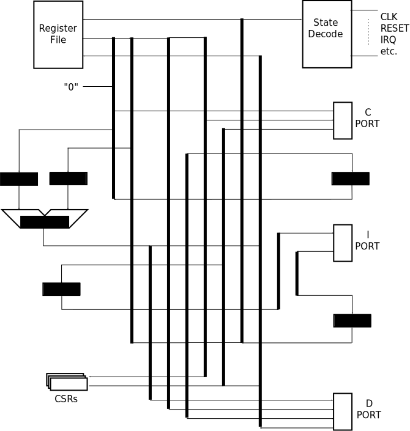

# Block Diagram

The following diagram illustrates the major components of the KCP53000.

As you can see,
the processor architecture consists primarily of a set of interconnects
routing data between different units within the processor.
The *State Decode* unit
is responsible for interpreting the current instruction
and recognizing to external CPU events.
Control signals eminating from the *State Decode* unit are elided for clarity.

## Harvard vs Von Neumann Configurations

If the I port accesses its own memory,
independent of the memory accessed on the D port,
the processor is said to be operating in a Harvard-architecture configuration.
Otherwise,
through the addition of a dual-port bus bridge to bring I and D ports together,
where they both access a common pool of memory,
the processor is then said to be operating in a Von Neumann-architecture configuration.

